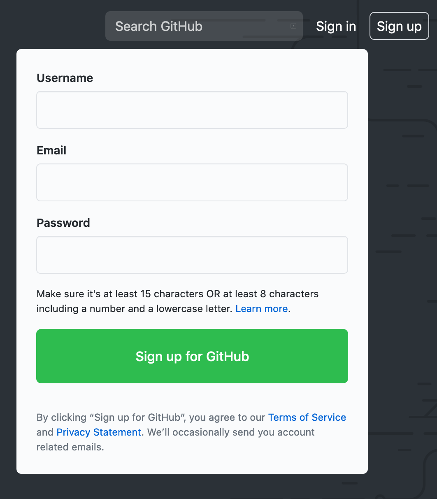
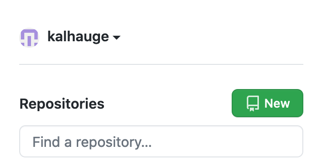
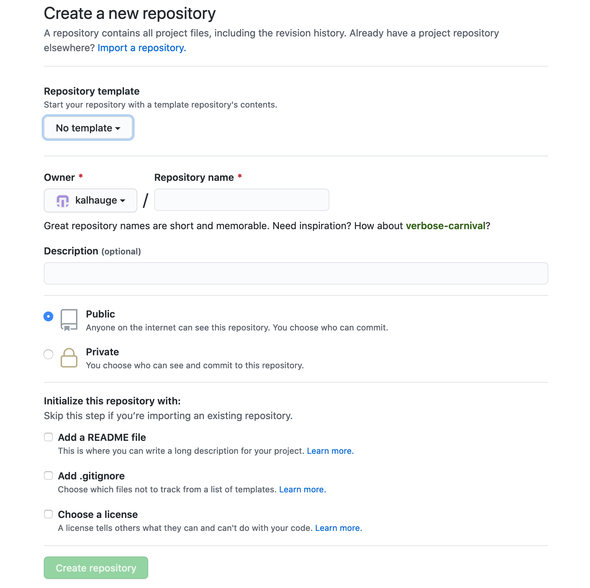
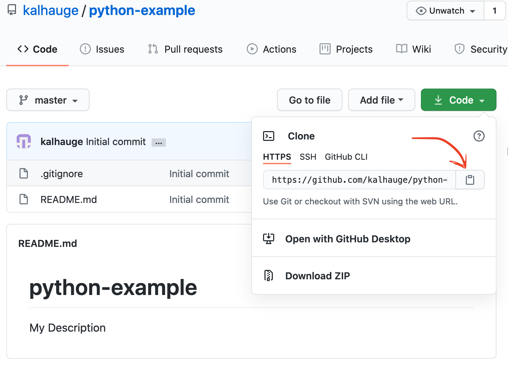

--- 
title: Avanceret Programmering (Uge 40)
author: Christian Gram Kalhauge (CKL)
aspectratio: 43
theme: Copenhagen
colortheme: seahorse
headers-includes: |
  \usepackage{absmath}
  \usepackage[utf8]{inputenc}
---

## Today

- Project

- Git / Github

- Sorting

# Project

## Project

100 hours project. 

- Due December 10th

- Deliveries and presentations (5 min) every 2 weeks:
  - October 8th
  - October 29th
  - November 12th
  - November 26th

- Delivery: Github-link with `README.md`.

- Exam: Presentation of project with follow-up questions.

# Git / Github

## Git

Git is a Version Control System. It is almost impossible to do any kind of 
development without it.

## Github - Create User

Create a user on GitHub



## Github - Create Repository



## Github - Create Repository (cont.)




## Git - Basics


### Commit

A specific point in time of the code

### Staging 

The place you put things to be committed.

### Branch

A pointer to a Commit.

### Remote

A remote storage of the version history.

## Git Bash

Download and install Git Bash from here: 

https://gitforwindows.org/

## Git' Started

Open `Git Bash` in the folder you'll like the code in.

```bash
$ git clone <paste-url>
```


## Git' Setup

```bash
$ git config --global user.name "Christian Kalhauge"
$ git config --global user.email ckl@cphbusiness.dk
```

## Git' Going

When you have made changes to your repository:

```bash
# stage all changes
$ git add .
# commit the staged changes with a commit message
# change <commit-message> with your message
$ git commit -m '<commit-message>' 
# push the results to the remote
$ git push
```

## Git' A Grip

See the status of the repository
```bash
$ git status
```

See the history
```bash
$ git log --oneline --graph --all
```

## Git' Back

Undo all your changes since last commit:
```bash
$ git checkout .
```

Go back a commit
```bash
$ git reset --hard HEAD^
```

Go back to the last version you uploaded
```bash
$ git reset --hard origin/master
```

## Git' Good

https://www.youtube.com/watch?v=2sjqTHE0zok

https://git-scm.com/book/en/v2/

https://davidenunes.com/git-good/

# Sorting

## Test if a list is sorted -- Exercise

`issorted.py`

## Bubblesort - Execise

https://en.wikipedia.org/wiki/Bubble_sort

`bubblesort.py`

## Merge - Execise

`merge.py`

## Mergesort - Exercise

https://en.wikipedia.org/wiki/Merge_sort

`mergesort.py`

## Quicksort - Exercise

https://en.wikipedia.org/wiki/Quicksort

`quicksort.py`


